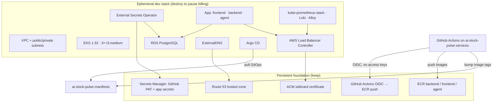

# AI Stock Pulse — AWS infrastructure

Terraform for a personal market-monitoring app on EKS. This repo is the
DevOps half of the project: a **persistent foundation** you keep, and an
**ephemeral dev cluster** you destroy when you are not using it.

The application code lives in
[ai-stock-pulse-services](https://github.com/OmriHalpert/ai-stock-pulse-services).
Cluster desired state (Helm + Argo CD) lives in
[ai-stock-pulse-manifests](https://github.com/OmriHalpert/ai-stock-pulse-manifests).


## Architecture

Two Terraform roots share one AWS account (`eu-west-1`). Foundation stays up so
DNS, TLS, and image registries do not have to be rebuilt. The EKS stack is sized
to be torn down overnight.



Public hosts (when the dev stack is up): `app.<domain>` and `grafana.<domain>`,
on one internet-facing ALB.


## Repository layout

```
foundation/           # Route 53, ACM, ECR, GHA OIDC, empty PAT secret
environments/dev/     # VPC, EKS, RDS, ALB controller, ESO, ExternalDNS, Argo CD
modules/              # reusable Terraform (vpc, eks, rds, argocd, …)
```

Remote state is S3 with native lock files (`use_lockfile`). There are no
`.tfvars` files in git; defaults live in `variables.tf`. Secrets are never in
Terraform source: RDS passwords are `random_password` written to Secrets
Manager, and the Argo GitHub PAT is stuffed into Secrets Manager by hand
(`aws secretsmanager put-secret-value`).

## Apply

You need AWS credentials that can create the account-level resources, Terraform
`>= 1.5`, and (for the dev stack) a working `kubectl` context after EKS comes up.

**1. Foundation** (once per account):

```bash
cd foundation
terraform init
terraform apply
```

Then put a GitHub PAT that can clone `ai-stock-pulse-manifests` into the empty
secret Terraform created (`ai-stock-pulse-argocd-github-pat`), and put Telegram /
LLM / Finnhub keys into `ai-stock-pulse-dev-app-secret` as JSON. Neither value
belongs in git.

**2. Ephemeral cluster:**

```bash
cd environments/dev
terraform init
terraform apply
```

Argo CD then clones the manifests repo and syncs the app plus monitoring.
First apply order matters: ALB controller before ESO/ExternalDNS, those before
Argo, so webhooks and CRDs exist before the first GitOps sync.

## Teardown (pause billing)

Destroy **dev only**. Leave foundation in place (hosted zone, certificate, ECR
images, OIDC provider).

```bash
cd environments/dev
terraform destroy
```

## Related repos

| Repo | Role |
| --- | --- |
| [ai-stock-pulse-services](https://github.com/OmriHalpert/ai-stock-pulse-services) | NestJS API, React UI, Python agent, CI → ECR |
| [ai-stock-pulse-manifests](https://github.com/OmriHalpert/ai-stock-pulse-manifests) | Helm chart, Argo Applications, Prometheus / Loki values |
